# CAM Architecture (Mermaid Diagrams)

> Date: 2026-03-27

## 1. System Overview

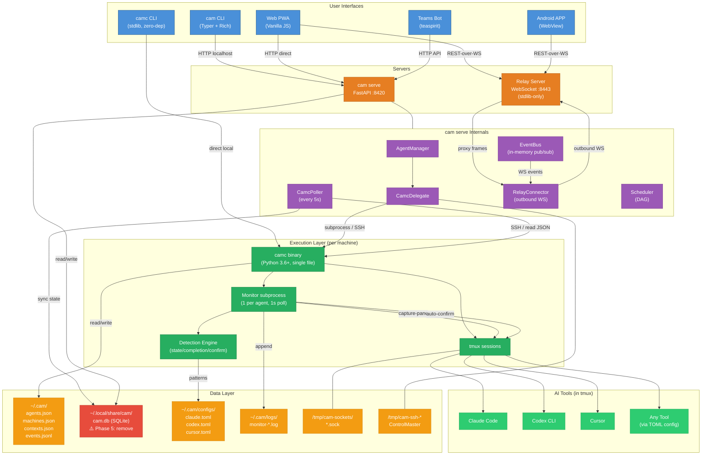

## 2. Agent Output Data Flow

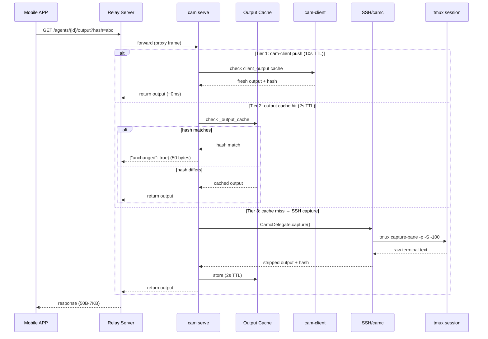

## 3. Agent Startup Flow

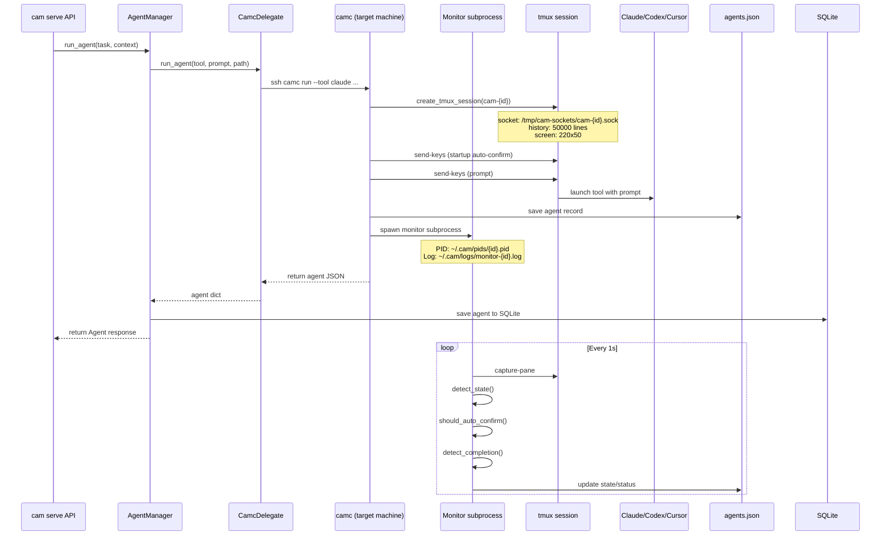

## 4. State Sync (camc → cam serve)

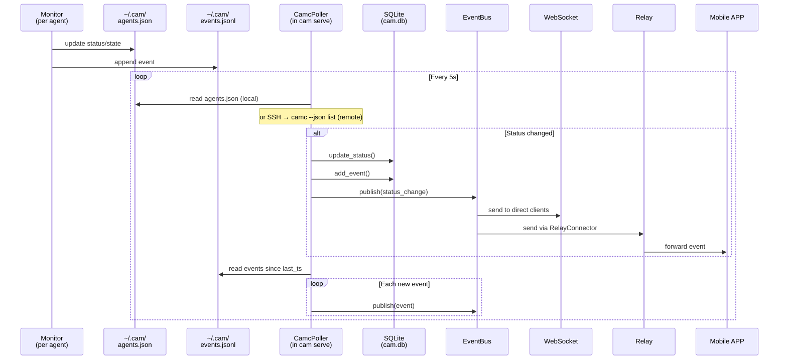

## 5. Relay NAT Traversal

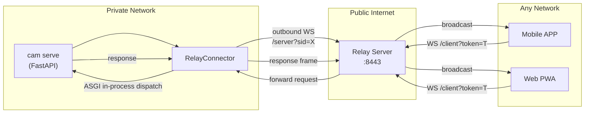

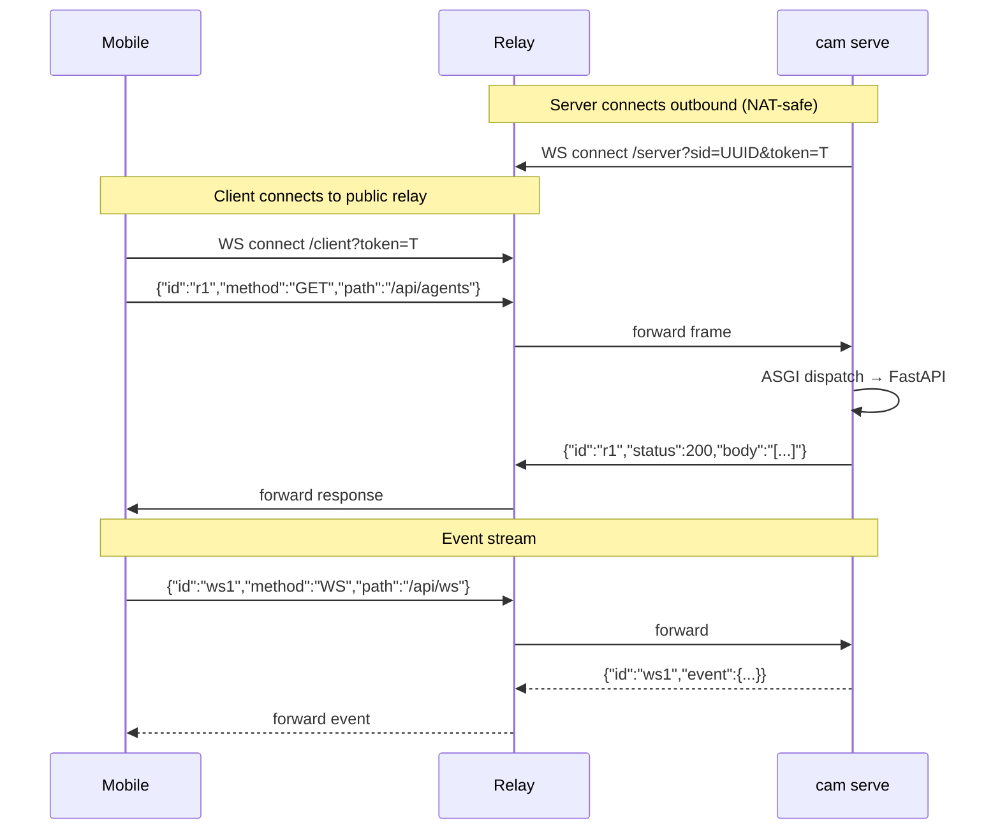

## 6. Transport Backends

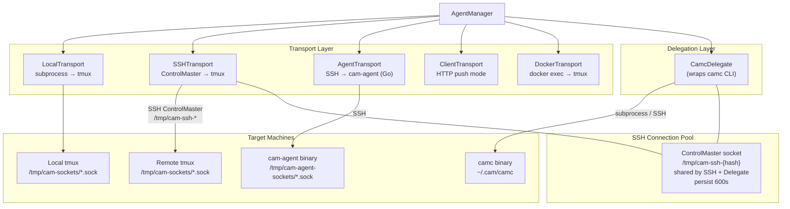

## 7. camc Internal Architecture

```mermaid
graph TB
    subgraph CLI["camc CLI (single-file, stdlib-only)"]
        run["run"]
        list["list"]
        stop["stop/kill"]
        heal["heal"]
        capture["capture"]
        send["send/key"]
        machine["machine<br/>list/add/rm/edit/ping"]
        context["context<br/>list/add/rm"]
        sync["sync"]
        migrate["migrate"]
        apply["apply (DAG)"]
    end

    subgraph Monitor["Monitor Subprocess (per agent)"]
        health["Health Check<br/>tmux_session_exists()"]
        cap["Capture<br/>capture_tmux()"]
        state["State Detection<br/>detect_state()"]
        confirm["Auto-Confirm<br/>should_auto_confirm()"]
        complete["Completion Detection<br/>detect_completion()"]
        autoexit["Auto-Exit<br/>kill_session / send /exit"]
    end

    subgraph Storage["Storage (JSON + fcntl)"]
        agents["AgentStore<br/>~/.cam/agents.json"]
        events["EventStore<br/>~/.cam/events.jsonl"]
        machines["MachineStore<br/>~/.cam/machines.json"]
        contexts["ContextStore<br/>~/.cam/contexts.json"]
    end

    subgraph Transport["Transport"]
        tmux["tmux sessions<br/>/tmp/cam-sockets/*.sock"]
        remote["Remote SSH<br/>(for sync/ping)"]
    end

    subgraph Config["Adapter Configs"]
        toml["~/.cam/configs/*.toml<br/>claude.toml<br/>codex.toml<br/>cursor.toml"]
    end

    run --> tmux
    run --> agents
    run -->|"spawn"| Monitor
    list --> agents
    stop --> tmux
    stop --> agents
    heal --> agents
    heal --> tmux
    heal --> events
    capture --> tmux
    send --> tmux
    machine --> machines
    context --> contexts
    sync --> remote
    sync --> machines
    migrate -->|"SQLite → JSON"| agents

    cap --> tmux
    state --> toml
    confirm --> toml
    confirm -->|"send-keys"| tmux
    complete --> toml
    health --> tmux
    autoexit --> tmux

    Monitor --> agents
    Monitor --> events
```

## 8. Data Layer

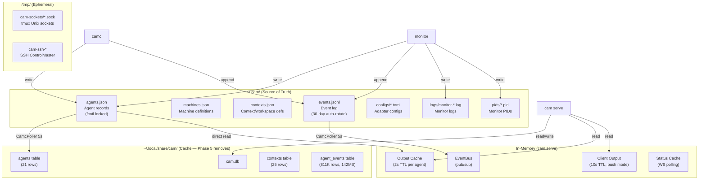

## 9. Authentication Flow

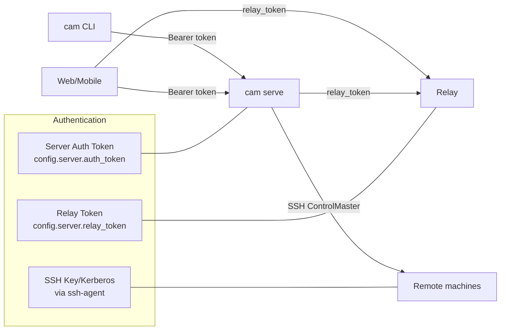

## Latency Summary

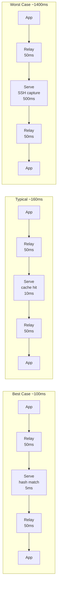
