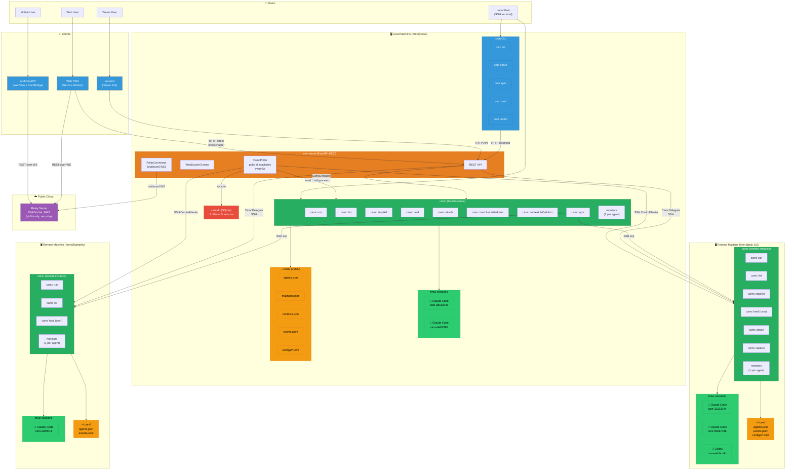
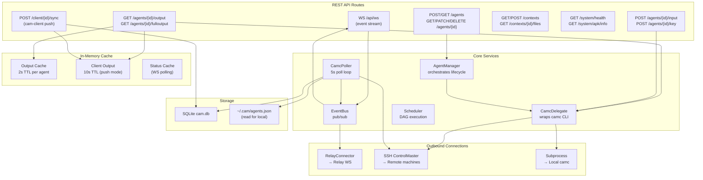
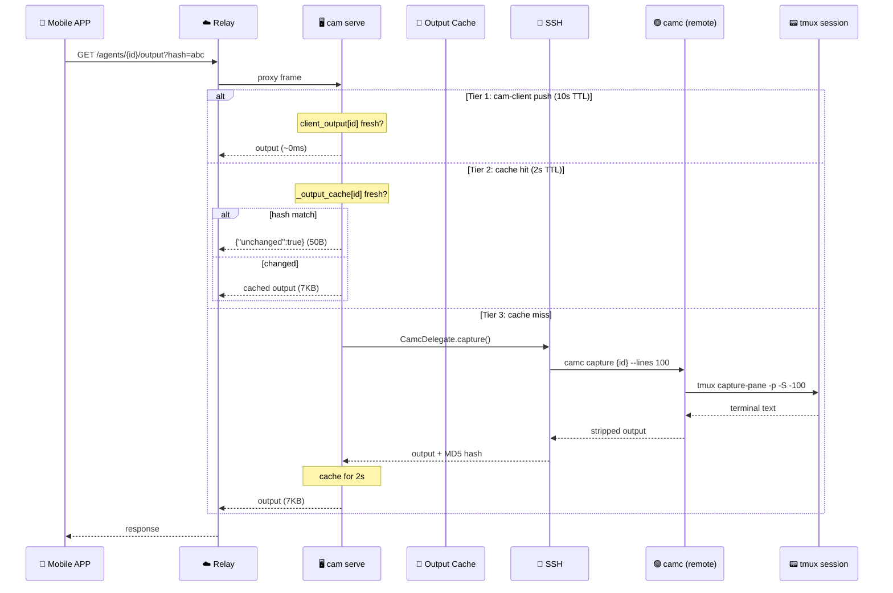
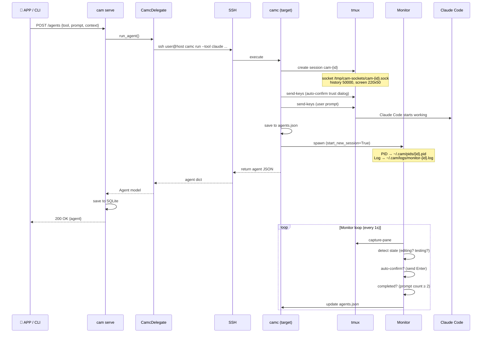
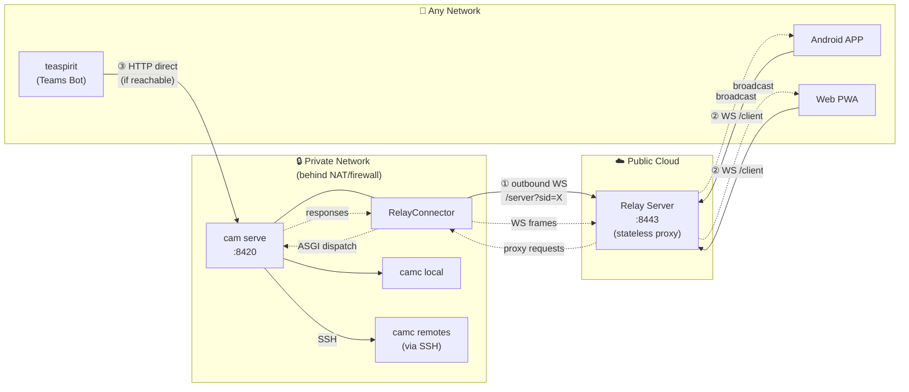
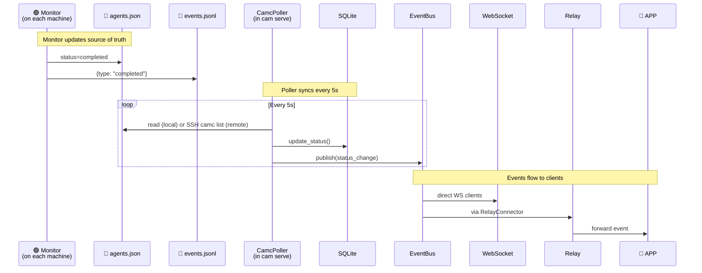
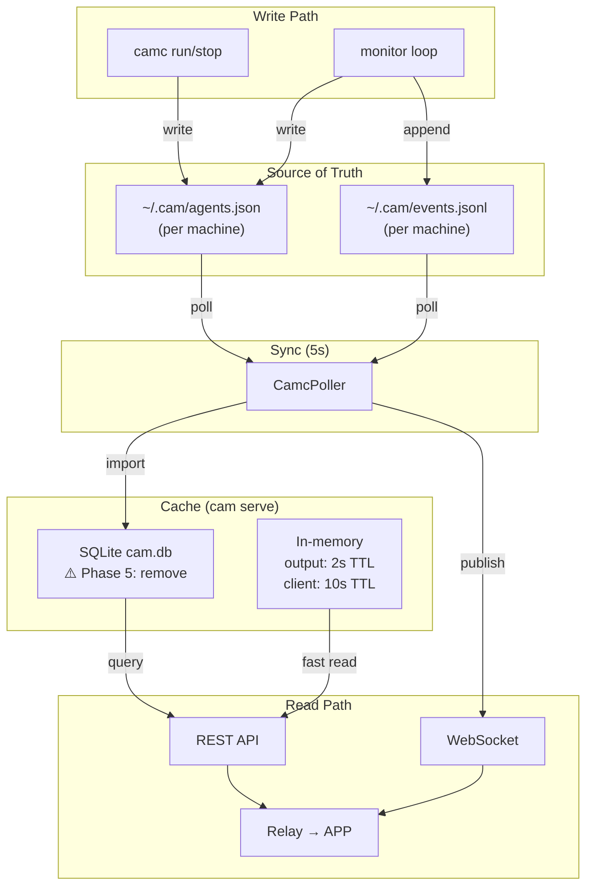
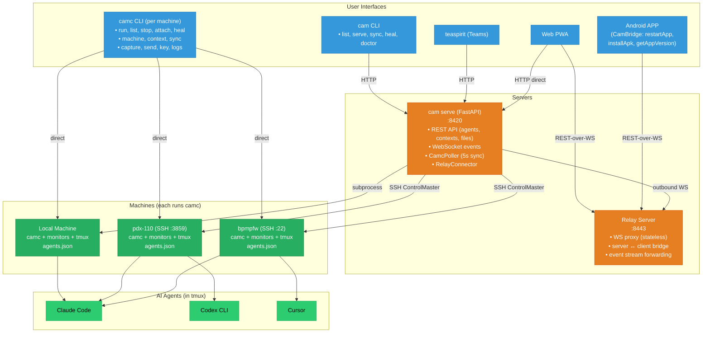

# CAM Architecture (Mermaid Diagrams)

> Date: 2026-03-27

## 1. Deployment Topology

## 2. cam serve Internal Architecture

## 3. camc Instance Detail

```mermaid
graph TB
    subgraph CLI["camc CLI Commands"]
        direction LR
        run["run<br/>start agent"]
        list["list<br/>show agents"]
        stop["stop/kill"]
        attach["attach<br/>tmux attach"]
        add["add<br/>adopt session"]
        logs["logs<br/>follow output"]
        capture["capture"]
        send["send/key"]
        status["status --json"]
        heal["heal<br/>(+ cron)"]
        apply["apply<br/>DAG scheduler"]
        history["history<br/>event log"]
        machine_cmd["machine<br/>list/add/rm/edit/ping"]
        context_cmd["context<br/>list/add/rm"]
        sync_cmd["sync<br/>deploy to remotes"]
        migrate_cmd["migrate<br/>SQLite→JSON"]
    end

    subgraph Monitor["Monitor (1 per agent, 1s loop)"]
        m_health["1. health check<br/>tmux_session_exists()"]
        m_capture["2. capture<br/>capture_tmux()"]
        m_state["3. state detection<br/>pattern → planning/editing/<br/>testing/committing/idle"]
        m_confirm["4. auto-confirm<br/>pattern → send Enter"]
        m_complete["5. completion detection<br/>prompt_count ≥ 2"]
        m_exit["6. auto-exit<br/>kill_session or /exit"]
    end

    subgraph Data["Storage"]
        agents["agents.json<br/>(fcntl locked)"]
        events["events.jsonl<br/>(30-day rotate)"]
        machines["machines.json"]
        contexts["contexts.json"]
        configs["configs/*.toml<br/>claude/codex/cursor"]
        pidfiles["pids/*.pid"]
        logfiles["logs/monitor-*.log"]
    end

    subgraph Sessions["tmux Sessions"]
        s1["cam-{id1}<br/>/tmp/cam-sockets/{id1}.sock"]
        s2["cam-{id2}<br/>/tmp/cam-sockets/{id2}.sock"]
        s3["cam-{id3}<br/>/tmp/cam-sockets/{id3}.sock"]
    end

    run --> Sessions
    run --> agents
    run -->|"spawn"| Monitor
    list --> agents
    stop --> Sessions
    stop --> agents
    attach --> Sessions
    capture --> Sessions
    send --> Sessions
    heal --> agents
    heal --> Sessions
    heal -->|"rotate"| events
    machine_cmd --> machines
    context_cmd --> contexts
    sync_cmd -->|"SSH scp"| machines

    Monitor --> Sessions
    Monitor --> agents
    Monitor --> events
    Monitor --> configs
    Monitor --> logfiles
    Monitor --> pidfiles

    m_health --> m_capture
    m_capture --> m_state
    m_state --> m_confirm
    m_confirm --> m_complete
    m_complete --> m_exit
```

## 4. Output Capture Path

## 5. Agent Startup Path

## 6. Relay NAT Traversal

## 7. State Sync Flow

## 8. Data Flow Summary

## 9. Complete Connection Map

