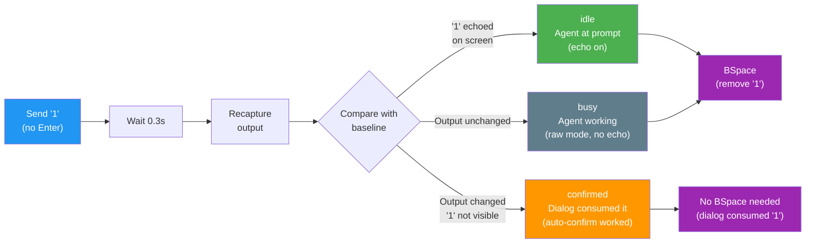
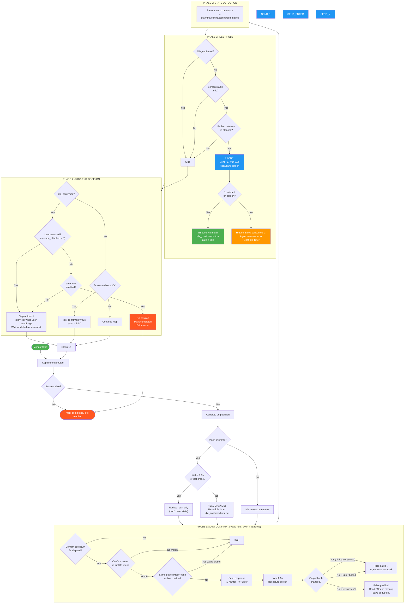
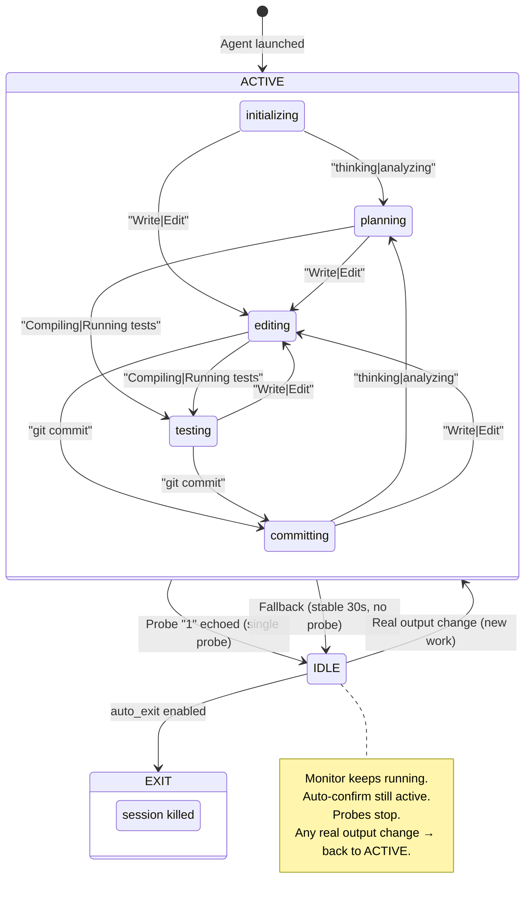
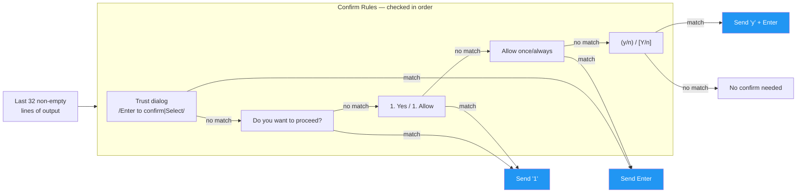
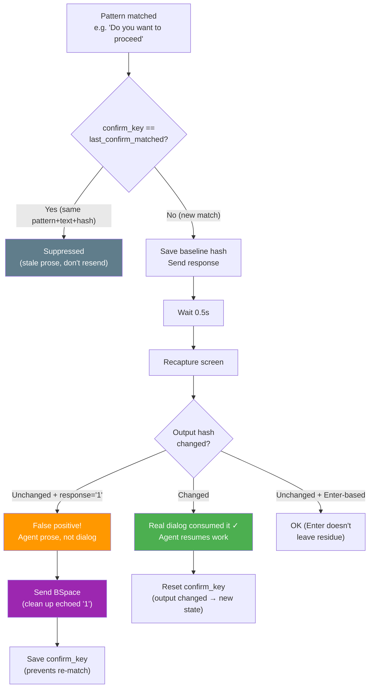
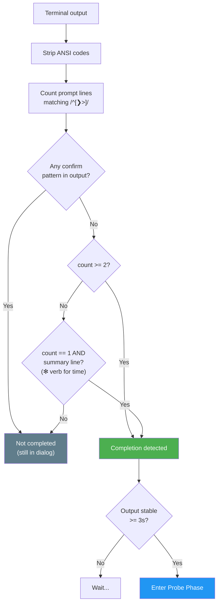
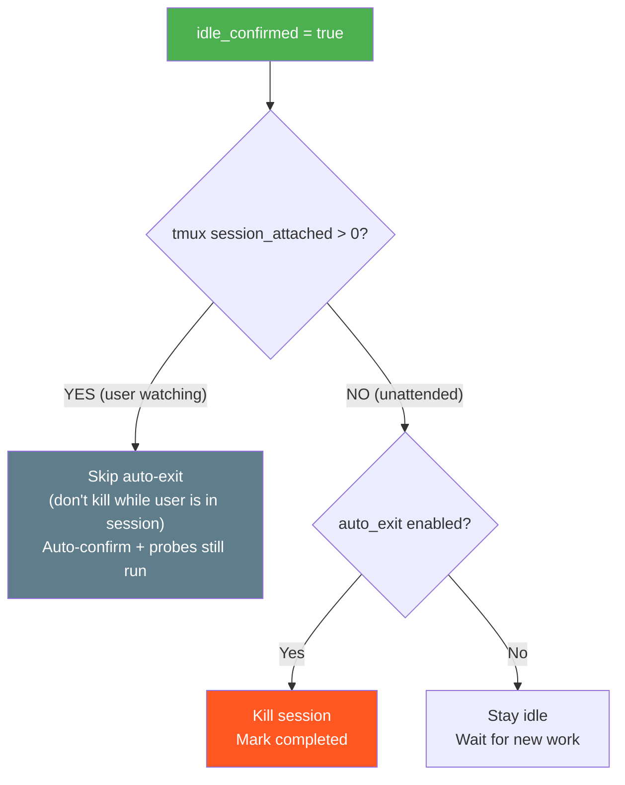
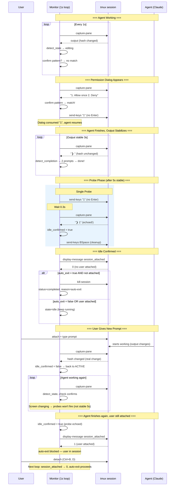

# Monitor State Machine & Decision Flow

> Date: 2026-04-01 | v2: Single-probe design with attachment awareness

## 1. Core Idea: Unified "1" + BSpace

Auto-confirm and idle probe share the same atomic operation: **send "1", observe, BSpace**.



**Why "1"?** Claude's permission menus show `1. Yes` / `1. Allow` as option 1. Sending "1" selects it. If no menu is showing and agent is at prompt, "1" just echoes and gets cleaned up by BSpace. If agent is busy in raw mode, "1" is silently dropped.

## 2. Monitor Main Loop (1s cycle)



## 3. State Transitions



## 4. Auto-Confirm Patterns



**Key: only check last 32 lines.** Permission dialogs always appear at the bottom. This prevents false positives when agent output contains text like "1. Yes" in a table or explanation.

## 4a. False Positive Protection

Auto-confirm can match agent **prose** (e.g. Claude writes "Do you want to proceed?" in its response), not just real permission dialogs. Two defenses prevent `1` accumulation:



### How `1` accumulation happened (old behavior)

```
Agent writes: "Do you want to proceed with this plan?"     ← prose, not dialog
Monitor matches "Do you want to proceed" pattern
Monitor sends "1" (no Enter, no BSpace)                    ← echoes at prompt: ❯ 1
5s cooldown...
Same text still on screen → matches again
Monitor sends "1" again                                    ← ❯ 11
5s cooldown...                                             ← ❯ 111
...repeats indefinitely                                    ← ❯ 111111111111111
```

### How it's prevented now

```
Agent writes: "Do you want to proceed with this plan?"     ← prose, not dialog
Monitor matches pattern → sends "1"                        ← echoes at prompt: ❯ 1
Monitor recaptures: hash unchanged (prose didn't consume)
Monitor sends BSpace → cleaned up                          ← ❯
Monitor saves confirm_key = "pattern:matched:hash"
5s cooldown...
Same text still on screen → same confirm_key → SUPPRESSED
No "1" sent. Clean terminal.
```

## 5. Completion Detection (prompt_count strategy)



## 6. Attachment Awareness



**Attachment only blocks auto-exit, nothing else.** Probes are safe when the screen is stable — if the user is actively typing, the screen won't be stable for 5s, so probes won't fire. Auto-confirm always runs because the user watching doesn't mean they want to manually handle permission dialogs. The only dangerous action is killing a session while a user is sitting in it.

## 7. Full Lifecycle Timeline



## 8. Key Design Decisions

### Single probe vs consecutive probes

**Old design:** Required 2+ consecutive idle probes (threshold=2) with 20s cooldown between them. ~31s from completion to idle confirmed.

**New design:** Single probe is sufficient. If `1` echoes at the prompt, the agent is idle — period. The echo IS the proof. ~8s from completion to idle confirmed.

### Attachment awareness

| Phase | User attached | User not attached |
|-------|:---:|:---:|
| Auto-confirm | Runs | Runs |
| State detection | Runs | Runs |
| Idle probe | Runs | Runs |
| Auto-exit | **Blocked** | Runs (if enabled) |

Everything runs normally regardless of attachment. The only thing blocked is auto-exit — never kill a session a user is sitting in. Probes are safe because the "screen stable 5s" gate naturally prevents them while the user is actively typing.

### Idle → Active revival

Idle is never permanent. Any real output change (not probe-caused) sets `idle_confirmed = false` and resumes the full monitor cycle. This handles:
- User gives new prompt via attached tmux
- Auto-confirm accidentally resumes agent
- Agent wakes up on its own (file watcher, timer)

## 9. Timing Parameters

| Parameter | Value | Description |
|-----------|-------|-------------|
| `confirm_cooldown` | 5s | Min interval between auto-confirm attempts |
| `completion_stable` | 3s | Output must be stable before checking completion |
| `probe_stable` | 5s | Stable time before probe |
| `probe_cooldown` | 5s | Min interval between probes (if needed) |
| `probe_wait` | 0.3s | Wait after sending "1" before recapture |
| `health_check_interval` | 15s | Session-alive check interval |
| `fallback_stable` | 30s | Long-stable fallback for idle when probes skipped |

### Time from task done to idle confirmed

```
Task finishes, output stabilizes              0s
  ├─ completion_stable (3s)                   3s   ← completion detected
  ├─ probe_stable (5s)                        5s   ← probe eligible
  ├─ check attached → no                      5s
  ├─ send "1", wait 0.3s, recapture           5.3s
  ├─ "1" echoed → BSpace                      5.5s ← idle confirmed!
  └─ auto_exit (if enabled)                   ~6s
```

~6 seconds from completion to auto-exit (down from ~31s in old design).
