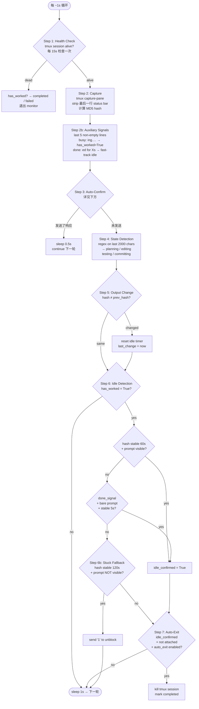
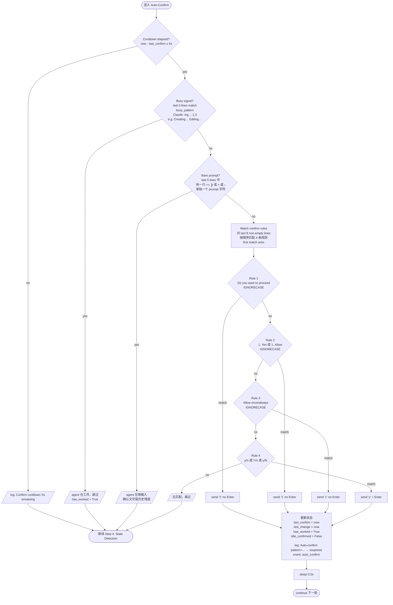

# Auto-Confirm Flow

camc monitor 每 ~1s 执行一次循环，Auto-Confirm 是其中 Step 3。

## Monitor 完整循环



## Step 3: Auto-Confirm 详细流程



## Confirm Rules (Claude Code)

| 优先级 | Pattern | 场景 | 响应 | Enter |
|--------|---------|------|------|-------|
| 1 | `Do\s+you\s+want\s+to\s+proceed` | 权限对话框：Do you want to proceed? ❯ 1. Yes 2. No | `1` | ✗ |
| 2 | `1\.\s*(Yes\|Allow)` | 数字菜单：1. Yes / 1. Allow | `1` | ✗ |
| 3 | `Allow\s+(once\|always)` | Claude 4.x+ Ink 选择菜单 | `1` | ✗ |
| 4 | `\(y/n\)\|\[Y/n\]\|\[y/N\]` | 标准 y/n 确认 | `y` | ✓ |

前 3 条都是 Claude Code 的 Ink TUI 组件——单按键选择，不需要 Enter。
第 4 条是标准终端 y/n 提示，需要 Enter 确认。

## 关键设计参数

| 参数 | 值 | 作用 |
|------|-----|------|
| `confirm_cooldown` | 5s | 两次 confirm 之间最小间隔，防止对同一对话框重复发送 |
| `confirm_sleep` | 0.5s | 发送后等待，让 agent 处理输入 |
| `busy_pattern` | `ing[.…]{1,3}` | 匹配 "Creating…" "Editing…" 等进行时动词 |
| `done_pattern` | `ed\s+for\s+\d+[smh]` | 匹配 "Crunched for 36s" 等完成时动词 |
| Confirm 扫描范围 | last 8 non-empty lines | 只看屏幕底部，避免 agent 输出中的文字误触发 |
| Busy/Done 扫描范围 | last 5 non-empty lines | 状态信号在屏幕最底部 |
| Bare prompt 扫描范围 | last 5 non-empty lines | 检测 agent 是否在等待输入 |

## 三道防线

```
Screen captured
     │
     ├─ 防线 1: Cooldown (5s)     → 同一对话框不连续发送
     │
     ├─ 防线 2: Busy signal       → agent 在工作，不是卡在对话框
     │
     ├─ 防线 3: Bare prompt       → agent 在等输入，确认文字是残留
     │
     └─ 通过全部防线 → 匹配 last 8 lines → 发送响应
```
