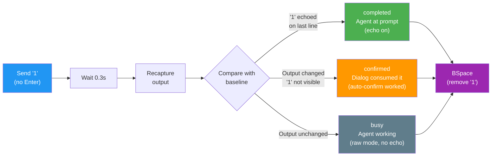
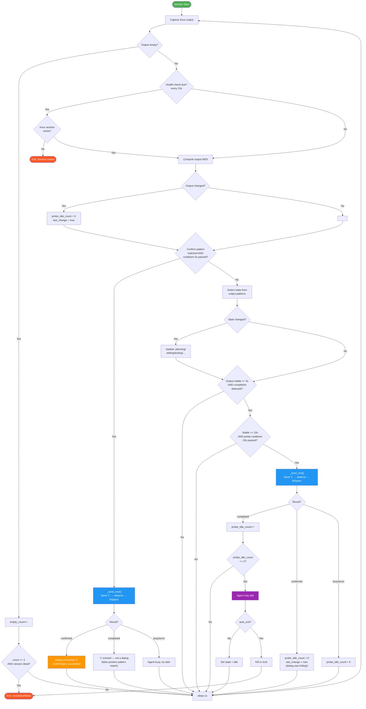
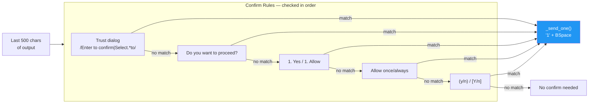
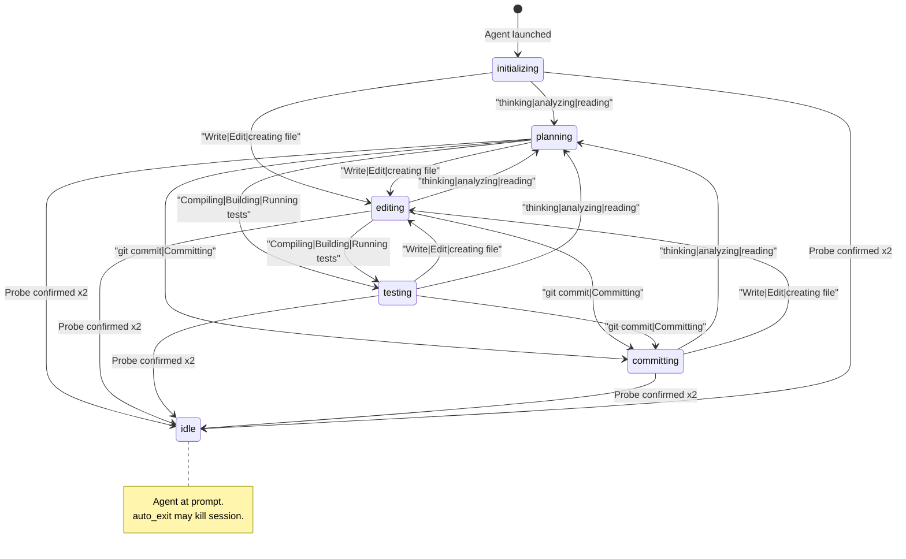
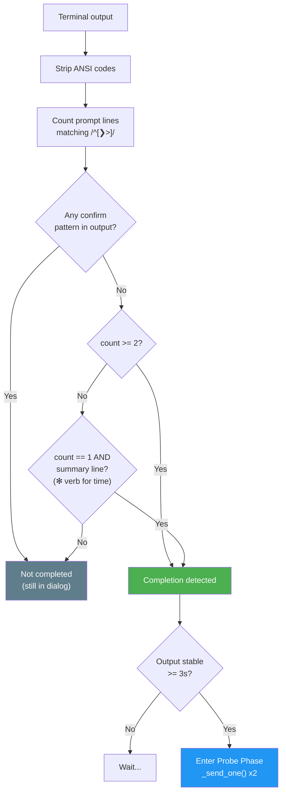
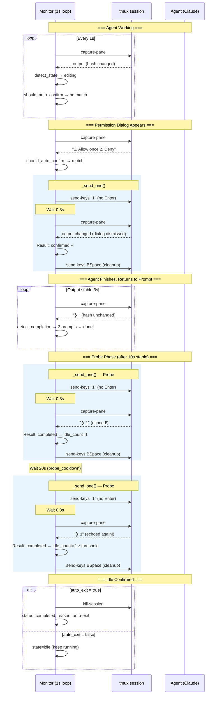

# Monitor State Machine & Decision Flow

> Date: 2026-03-27 | Covers: unified "1"+BSpace confirm/probe, state detection, auto-exit

## 1. Core Idea: Unified "1" + BSpace

Auto-confirm and idle probe share the same atomic operation: **send "1", observe, BSpace**.



**Why "1"?** Claude's permission menus show `1. Yes` / `1. Allow` as option 1. Sending "1" selects it. If no menu is showing and agent is at prompt, "1" just echoes and gets cleaned up by BSpace. If agent is busy in raw mode, "1" is silently dropped.

## 2. Monitor Main Loop (1s cycle)



## 3. Auto-Confirm Trigger Patterns

These patterns trigger `_send_one()` (send "1" + BSpace):



## 4. Agent State Detection



## 5. Completion Detection (prompt_count strategy)



## 6. Full Lifecycle Timeline



## 7. Timing Parameters

| Parameter | Default | Description |
|-----------|---------|-------------|
| `confirm_cooldown` | 5s | Min interval between auto-confirm attempts |
| `confirm_sleep` | 0.5s | Sleep after confirm before next loop |
| `completion_stable` | 3s | Output must be stable before checking completion |
| `probe_stable` | 10s | Stable time before first probe |
| `probe_cooldown` | 20s | Min interval between probes |
| `probe_wait` | 0.3s | Wait after sending "1" before recapture |
| `probe_idle_threshold` | 2 | Consecutive "completed" probes to confirm idle |
| `health_check_interval` | 15s | Session-alive check interval |
| `empty_threshold` | 3 | Consecutive empty captures before death check |

### Time from task done to idle confirmed (worst case)

```
Task finishes, output stabilizes              0s
  ├─ completion_stable (3s)                   3s   ← completion detected
  ├─ probe_stable (10s)                      10s   ← first probe eligible
  ├─ _send_one() #1 → completed             10.5s
  ├─ probe_cooldown (20s)                    30.5s  ← second probe eligible
  ├─ _send_one() #2 → completed             31.0s  ← idle confirmed!
  └─ auto_exit (if enabled)                  ~31s
```
